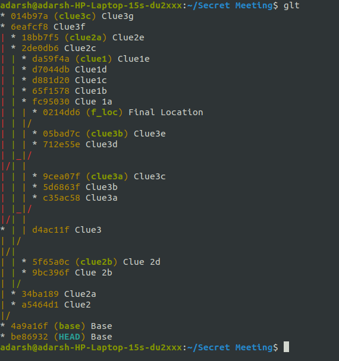
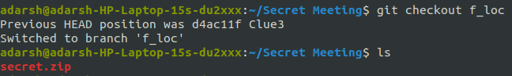
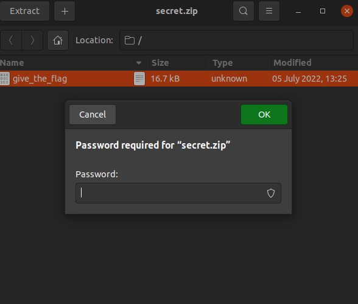
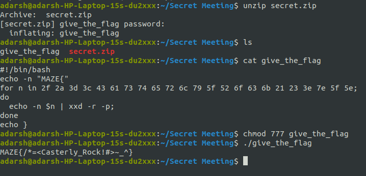

## Secret Meeting 2

Category: Misc (Git+Linux)

Author: Adarsh Kishore

Answer / Flag: `MAZE{/*=<Casterly_Rock!#>~_^}`

## Problem Statement

Jon Snow has organized yet another meeting with the seven kingdoms. To ensure utmost secrecy, he has chosen the location in a maze shaped like a *tree*, with an entrance of *deception*, with several *branches* inside the maze, many of which lead to deadends. At the end, he has finally revealed the actual location to go to.

Help Targaryen retrieve the message in the maze.

## Relevant files / links

https://drive.google.com/file/d/1xeTxq2t-g5wm7x99FDojg2p0dbWGOWK8/view?usp=sharing

## Hint

1. Why not see what's inside the folder?
2. Not all commits are referenced by branches

## Solution

The given file system has a folder `What's in a name?`. Going inside, we can see that it is in fact a `.git` folder, hinted by calling it a maze with an entrance of *deception*. Rename it accordingly to reveal several *branches*, and a detached `HEAD`.
It is in form of a *tree*, as hinted in the problem statement.

If we do  `git checkout f_loc`, then we can see there is a `zip` file, which is password protected:

The password for this has its fragments distributed all over the commit history. There are several deadends and only three commits actually contain any data:
1. `pAss` in `clue1~3` as written in `flag` as `You have reached the first part of the key - 'pAss'...Keep looking for more`
2. `Word` in `clue2a~1` or `clue2a^` as written in `flag` as `The second part is "Word"... One more remains`
3. `-is-Winterfell` in `clue3c~2`

Joining them, the password is revealed to be `pAssWord-is-Winterfell` which unzips the file. Inside there is a file `give_the_flag` which does not have executable permissions. A simple `chmod` will do the trick and on executing it outputs the flag `MAZE{/*=<Casterly_Rock!#>~_^}`.

