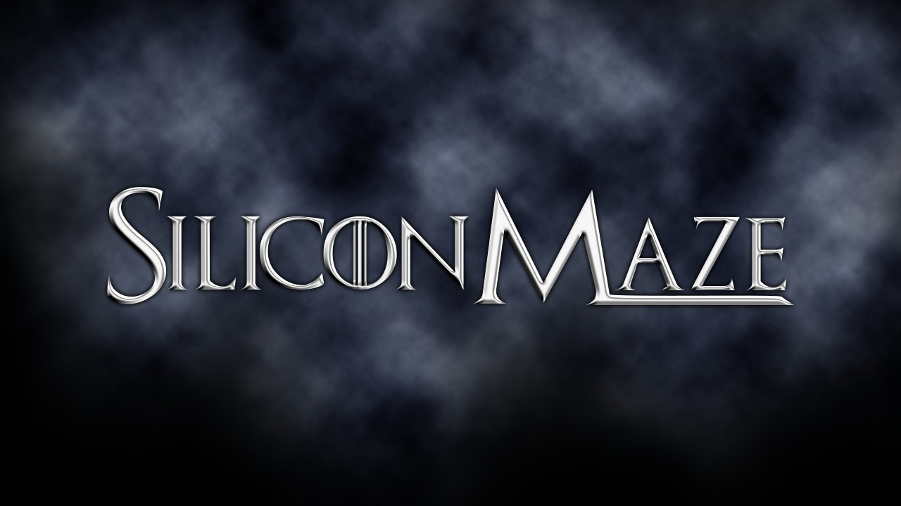

# What is this?

Category:Miscellaneous

Author: Asim Jawahir

Answer / Flag: `MAZE{32339}`

## Problem Statement

It is now the Great War, the war between the living and the dead. The world is in a state of chaos. You have intercepted a file from the enemy, which contains the secret to win the war. Find the answer within and save the world.


## Relevant files / links
[watisdis](https://drive.google.com/file/d/11bAXDUdnHLsp1kJ83U0RM_bnDzjgzPfC/view?usp=sharing)

## Hint

No.1 Everyone likes a bigger dragon

## Solution

### Finding the correct format
The given file is a py file however it is unreadable by the computer.

To find the correct format we can use the following command:
``` sh
file watisdis.py
``` 
We get the output as 
``` sh
watisdis.py: Zip archive data, at least v2.0 to extract, compression method=store
```

We now convert the file to a zip file and we are able to extract it.

### Finding the correct information

One way of finding the unique files is by searching for files greater than 10kb.
We can use the following code to find the files in python:
``` python
def find_files(folder, size):
    # Get all files in the folder
    files = os.listdir(folder)
    # Loop through all files
    for file in files:
        # Get the path of the file
        path = os.path.join(folder, file)
        # Check if the file is a file
        if os.path.isfile(path):
            # Check if the file is greater than 10kb
            if os.path.getsize(path) > size:
                print(path)
        else:
            # If the file is a folder, call the function again
            find_files(path, size)

find_files('path_to_folder', 10*1024)

```
The output is:
``` sh
D4K2SIRX4\FRHO0X\QOJPWE\M1DL687XUC\3PZ22TG.txt
D4K2SIRX4\FRHO0X\QOJPWE\M1DL687XUC\7IAX96LX.txt
```

From 3PZ22TG.txt we get an image in the from of a base64 encoded string.
```
data:image/jpeg;base64,/9j/4AAQSkZJRgABAQAAAQABAAD/2wB........
```
And from 7IAX96LX.txt we get the following Hints:
``` sh
Embrace The Darkness And Find The Answer Only Pure Darkness Unaltered Can Show You The Way
The Path Starts NUL SOH STX ETX EOT ENQ
PS:The Answer Should be Of Fourty Eight To Fifty Seven of the path
```
From the first hint it can be infered that we can get the answer from counting the number of completely black pixels(0,0,0) in the image.
The second and third hint shows that the answer should be accepted in the form of digits. ASCII Table starts from NUL SOH STX ETX EOT ENQ and the 48 - 57 corresponds to digits 0-9

### Decoding the image file and finding the total number of black(#000000) pixels
We can use an [online tool](https://codebeautify.org/base64-to-image-converter) to help us easily decode the image.

The decoded image is shown below:


We can use the following code to count the number of black pixels:
``` python
def count_pixels(image):
    # Open the image
    img = Image.open(image)
    pixels = img.load()
    count = 0
    # Loop through all pixels
    for x in range(img.size[0]):
        for y in range(img.size[1]):
            # Check if the pixel is black
            if pixels[x,y] == (0,0,0):
                count += 1
    return count

print(count_pixels("info.jpeg"))
```
The output is:
``` sh
32339
```

Entering the flag MAZE{32339} into the answer field will give you the points!
