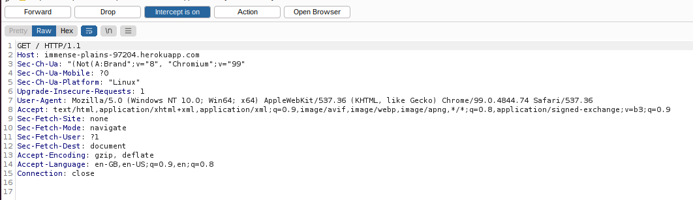
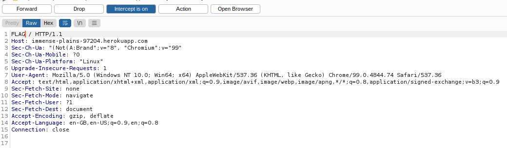

# **Request FLAG**

Category: Web

Author: Kavya Bhat

Answer / Flag: `MAZE{r3qu3st_th3_fl@g}`

## Problem Statement

Jaime Lannister needs to get back a flag from Petyr Baelish, and eventually sends Tyrion to obtain it. Littlefinger won't fall for any of the usual methods of diplomacy. However, there must be some method by which Tyrion can request the flag from that skilled manipulator - can you help him?

## Relevant files / links

https://immense-plains-97204.herokuapp.com/

## Hint

Maybe he needs to modify his _method_ of _requesting_ the flag...

## Solution

The challenge requires you to change the request method from GET to a custom method, in this case, `FLAG`. Using Burpsuite, you can intercept the HTTP request and view the message: 

Change the request method from `GET` to `FLAG`, and forward the modified message: 

The webpage now displays the flag.